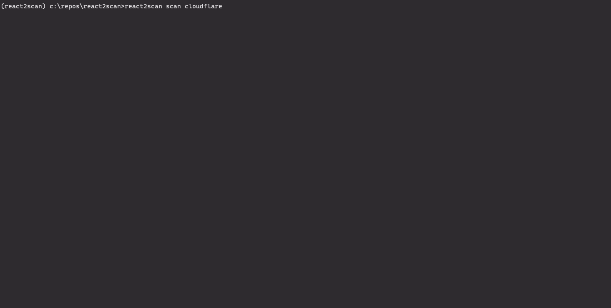
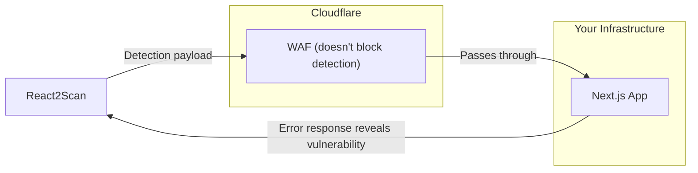

<div align="center">

# React2Scan

[](https://www.python.org/downloads/)
[](https://opensource.org/licenses/MIT)
[](https://github.com/psf/black)

<pre>
_   ___
| | |__ \
_ __ ___  __ _  ___| |_   ) |___  ___ __ _ _ __
| '__/ _ \/ _` |/ __| __| / // __|/ __/ _` | '_ \
| | |  __/ (_| | (__| |_ / /_\__ \ (_| (_| | | | |
|_|  \___|\__,_|\___|\__|____|___/\___\__,_|_| |_|

by Miggo Security
</pre>

**Discover and scan vulnerable Next.js instances across your entire infrastructure.**

[Key Features](#key-features) • [Installation](#installation) • [Quick Start](#quick-start) • [How It Works](#how-it-works)

</div>

---

## 🔍 The Problem

**CVE-2025-55182 (React2Shell)** is a critical RCE vulnerability in Next.js. If you run Next.js in production, you need answers:

1.  **Where are my Next.js apps?** In large organizations, apps get deployed across dozens of domains and subdomains. Shadow IT happens. Acquisitions bring unknown assets. Your inventory is probably incomplete.

2.  **Which ones are actually vulnerable?** Not every Next.js app is affected. You need to test them all before attackers do.

**React2Scan** automates both: discovers every Next.js instance across your Cloudflare domains, then scans them all in minutes.

## <a id="key-features"></a>✨ Key Features

- **🗺️ Infrastructure Mapping**: Discovers all domains and DNS records from your Cloudflare account.
- **⚡ Fast & Concurrent**: Multi-threaded scanning to handle thousands of domains quickly.
- **✅ Safe Detection**: Uses non-destructive payloads to detect vulnerabilities without executing code.
- **🛡️ WAF Status Checking**: Reports whether Cloudflare's Managed Ruleset is enabled for vulnerable targets.
- **🚀 Interactive Wizard**: `quickstart` mode guides you through the entire process.
- **📂 Portable Output**: Save infrastructure maps to JSON for sharing or CI/CD integration.

## 📺 Demo



## <a id="installation"></a>📦 Installation

Requires **Python 3.10+**.

```bash
# Clone the repository
git clone https://github.com/miggo-io/react2scan.git
cd react2scan

# Install in editable mode
pip install -e .
```

## <a id="quick-start"></a>🚀 Quick Start

The easiest way to start is using the interactive wizard:

```bash
react2scan quickstart
```

This will:
1.  Prompt for your Cloudflare API token.
2.  Discover all your domains and DNS records.
3.  Scan each hostname for the vulnerability.
4.  Check WAF status for any vulnerable targets.
5.  Report findings immediately.

## 🛠️ Usage

### 1. Basic Scan
If you already have your environment set up:

```bash
export CLOUDFLARE_API_TOKEN="your-token-here"
react2scan scan cloudflare
```

### 2. The Two-Step Workflow
For large infrastructures or CI/CD integration, separate discovery from scanning.

**Step 1: Discover & Save**
```bash
react2scan discover cloudflare -o infra.json
```

**Step 2: Scan from File**
Scan from the saved map. No API token needed for this step.
```bash
react2scan scan -f infra.json
```

> **Note:** WAF status checking requires API credentials. When scanning from a file without credentials, you'll see a warning that WAF checks are skipped.

### 3. Options

| Flag | Description | Example |
|------|-------------|---------|
| `--threads / -c` | Concurrent scan threads | `-c 50` |
| `--paths / -p` | Custom paths to probe | `-p "/,/api,/admin"` |
| `--timeout` | Request timeout in seconds | `--timeout 10` |
| `--output / -o` | Save results to JSON | `-o results.json` |
| `--verify-ssl` | Enforce SSL verification | `--verify-ssl` |
| `--dry-run` | Show targets without scanning | `--dry-run` |

## ⚙️ Configuration

### Cloudflare Permissions
You need an API Token with:
*   **Zone: Read** (to list domains)
*   **DNS: Read** (to list records)
*   **Firewall Services: Read** (optional, for WAF status checking)

[Create a token here](https://dash.cloudflare.com/profile/api-tokens).

## <a id="how-it-works"></a>🧠 How It Works

React2Scan uses a **safe, non-RCE detection payload** that is not blocked by Cloudflare's WAF. This means we can scan directly through the CDN without needing to bypass it.



1.  **Discovery**: Queries the Cloudflare API to find all zones and DNS records.
2.  **Scanning**: Sends a malformed RSC payload to each hostname. Vulnerable apps return a specific error pattern.
3.  **WAF Check**: For any vulnerable targets, checks if Cloudflare's Managed Ruleset is enabled (which may block actual exploitation).

### Why This Works

The detection payload triggers a **parsing error** in vulnerable Next.js apps, not code execution. This side-channel approach:
- Is completely safe (no code runs on the target)
- Produces a distinctive error response that confirms the vulnerability
- Is not blocked by WAF rules designed to stop exploitation payloads

## 🤝 Contributing

We welcome contributions! Please see [CONTRIBUTING.md](CONTRIBUTING.md) for guidelines on how to help improve this project.

## 📜 Credits

*   Scanner logic based on research by the [Assetnote Security Research Team](https://github.com/assetnote/react2shell-scanner).
*   Developed by **Miggo Security**.

## ⚠️ Disclaimer

**For authorized security testing only.**
This tool is intended to help administrators secure their own infrastructure. Never scan targets you do not own or have explicit permission to test.
